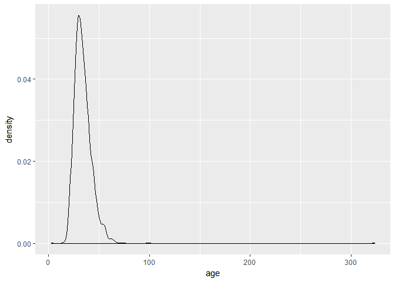
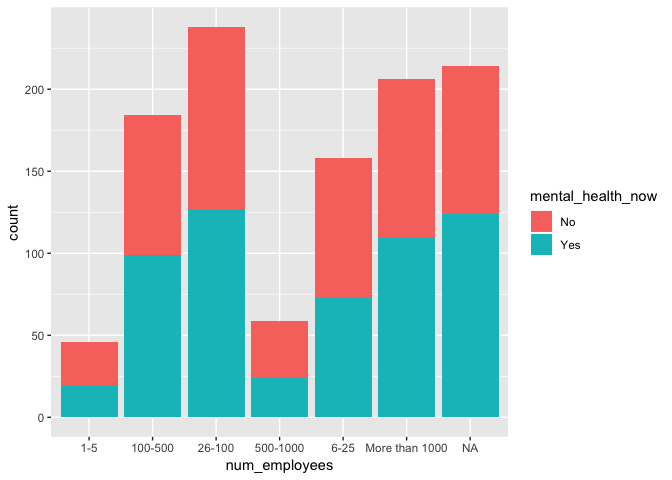
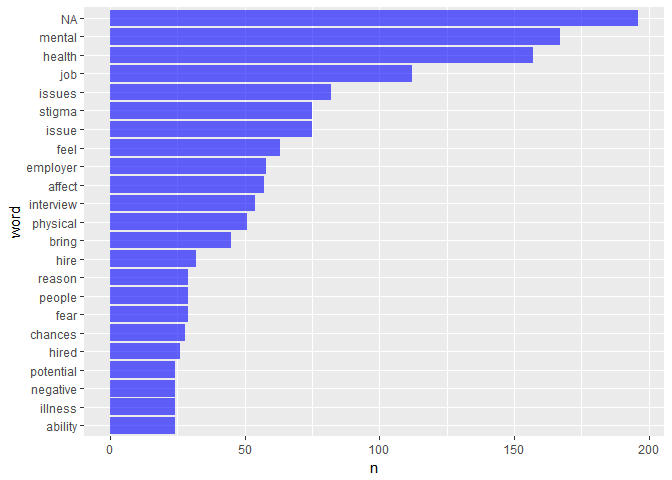
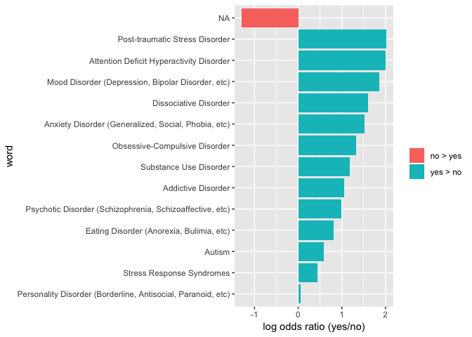
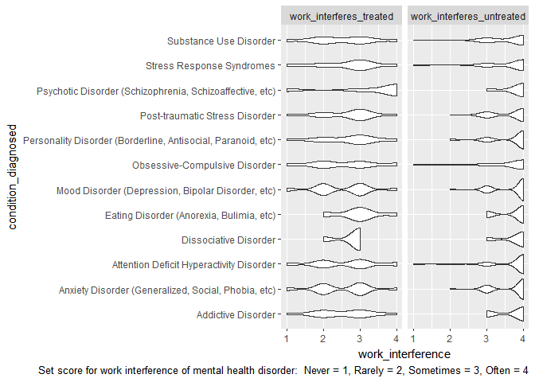

Report
================
12/5/2018

Motivation
----------

The purpose of this project is to apply the skills we learnt in “Data Science I” to access data in real world setting and preferably make some impact on a concerning public health issue. In this case, we choose to analyze the mental health data gathered from an online survey done by OSMI, and hope our report could promote workplace mental health awareness and be used as reference by job seeker while job haunting. However, after exploring our data, we found that we aren’t able to answers some question we listed in the proposal, since our data is very limited.

Related work
------------

Mental health has always been an interesting topic since it is closely related to our life, 20 percent of the total population have diagnosable mental disorder, also, recent study showed that graduate student are at more risk of depression. Therefore, while browsing Kaggle, the challenge of mental health in tech companies immediately draw our attention. As future biostatistician, It is highly possible that we will pursue a tech career. And knowing whether particular work type is more stressful, if some factor are more associated with depression, will help guide us through the job seeking process and maybe even provide some help when others are facing mental health issues.

Initial questions
-----------------

Initially, we want to answer the following questions: Do mental health illness and attitudes towards mental health vary by geographic location? How strong is the association between family history and mental health illness or other predictors? Attitudes toward mental health VS attitudes toward physical health consequence? Do tech companies provide more or less mental health benefits compared to non-tech company?

After exploring the data, we found that the we are not able to answer the latter two of our proposed question, since most of the participant in the survey are either from a tech company or is working as a tech in non-tech company. Also, the attitude towards mental health are very difficult to access since the questionnaire is asking what do participant think that their company would react if they had mental health illness, and this information could be highly biased since there is no standard measure. Instead, we decide to look into the number of people with mental health disorder vary by geographic location, and found that in general around 50% of participant of the survey is currently having mental health issue. Some states have higher percentage than other, but since some states only have one or two people who take the survey, those states tend to have extreme values like 100% or 0 %. For the second question, since mental health illness is a categorical variable, we are unable to use it as a response variable within a linear model. Therefore, we performed conditional inference tree and decision tree to analyze the data, and found family history of mental health illness and the size of the company is associated with current mental health illness. Although some of the question are not accessible, we found other interesting trend while exploring, such as the impact of work performance of mental health illness treatment, and people with particular mental health disease are more willing to seek treatment than others, and these questions will be further discussed in the exploration analysis session of the report.

Data
----

### Data Source

Our [data](https://www.kaggle.com/osmi/mental-health-in-tech-2016/downloads/mental-health-in-tech-2016.zip/1) comes from [OSMI Mental Health in Tech Survey](https://osmihelp.org/research/) which we first find in [kaggle](https://www.kaggle.com/osmi/mental-health-in-tech-2016).

This data includes 1433 observations and 63 variables.

### Data cleaning

``` r
library(tidyverse)
```

    ## Warning: package 'tidyverse' was built under R version 3.4.4

    ## Warning: package 'ggplot2' was built under R version 3.4.4

    ## Warning: package 'tibble' was built under R version 3.4.4

    ## Warning: package 'tidyr' was built under R version 3.4.4

    ## Warning: package 'readr' was built under R version 3.4.4

    ## Warning: package 'purrr' was built under R version 3.4.4

    ## Warning: package 'dplyr' was built under R version 3.4.4

    ## Warning: package 'stringr' was built under R version 3.4.4

    ## Warning: package 'forcats' was built under R version 3.4.4

``` r
library(tidytext)
```

    ## Warning: package 'tidytext' was built under R version 3.4.4

First, we should import data.

``` r
mentalhealth_2016_df = read_csv("./data/mental_health_in_tech_2016.csv") 
```

    ## Parsed with column specification:
    ## cols(
    ##   .default = col_character(),
    ##   `Are you self-employed?` = col_integer(),
    ##   `Is your employer primarily a tech company/organization?` = col_integer(),
    ##   `Is your primary role within your company related to tech/IT?` = col_integer(),
    ##   `Do you have medical coverage (private insurance or state-provided) which includes treatment of  mental health issues?` = col_integer(),
    ##   `Do you have previous employers?` = col_integer(),
    ##   `Have you ever sought treatment for a mental health issue from a mental health professional?` = col_integer(),
    ##   `What is your age?` = col_integer()
    ## )

    ## See spec(...) for full column specifications.

Variables name in this data set are questions, so we change it to [short words](Variable%20name.pdf) for easy-reading.

``` r
colnames(mentalhealth_2016_df) <- c("self_employed", "num_employees", "tech_company", "tech_role", "benefits", "care_options", "employer_discussion", "employer_help", "anonymity", "medical_leave", "mental_health_consequences", "physical_health_consequences", "coworkers_discussion", "supervisor_discussion", "mental_vs_physical", "obs_consequence", "medical_coverage", "help_resourcces", "whether_reveal_business_contacts", "reveal_concequences_business_contects", "whether_reveal_coworkers", "reveal_concequences_coworkers", "productivity_affect", "work_time_affected", "preemployers", "preemployers_benefits", "preemployers_care_options", "preemployers_discussion", "preemployer_help", "pre_anonymity", "pre_mental_health_consequences", "pre_physical_health_consequences", "pre_coworkers_discussion", "pre_supervisors_discussion", "pre_mental_vs_physical", "pre_obs_consequence", "physical_health_interview", "physical_health_interview_reason", "mental_health_interview", "mental_health_interview_reason", "career_influence", "coworkers_view", "friends_family_share", "unsupportive_badly_handled", "less_likely_reveal", "family_history", "mental_health_previous", "mental_health_now", "condition_diagnosed", "possible_condition", "professional_diagnosed", "condition_professional_diagnosed", "seek_treatment", "work_interferes_treated", "work_interferes_untreated", "age", "gender", "country_live", "territory_live", "country_work", "territory_work", "work_position_kind", "work_remotely")
```

The age of one observation is 323 which is impossible, so we exclude this observation. Besides, there are lots of different forms of answers in `gender` variable which makes analysis process more difficult, so we use 'Female' and 'Male' to represent gender in each observation.

``` r
mentalhealth_2016_tidied =
  mentalhealth_2016_df %>% 
  filter(age < 100) %>% 
  mutate(gender = str_replace(gender, "^[Ww]oman$", "Female"),     # female
         gender = str_replace(gender, "^[Ff]$", "Female"),
         gender = str_replace(gender, "^fem$", "Female"),
         gender = str_replace(gender, "^female$", "Female"),
         gender = str_replace(gender, "^female/woman$", "Female"),
         gender = str_replace(gender, "^fm$", "Female"),
         gender = str_replace(gender, "AFAB", "Female"),
         #gender = str_replace(gender, "AFAB", "Female"),
         gender = str_replace(gender, "^[Mm]$", "Male"),  # male
         gender = str_replace(gender, "^mail$", "Male"),  #?
         gender = str_replace(gender, "^MALE$", "Male"),
         gender = str_replace(gender, "^Male.$", "Male"),
         gender = str_replace(gender, "^Malr$", "Male"),    #?
         gender = str_replace(gender, "^[Mm]an$", "Male"),
         #gender = str_replace(gender, "^man$", "Male"),
         gender = str_replace(gender, "^male$", "Male"))
```

    ## Warning: package 'bindrcpp' was built under R version 3.4.4

Exploratory Analysis
====================

For exploratory analysis, we did summary for gender and the working location of participants. We also create the age distribution and the plot suggests that most participants are between 30 to 40 years old. In addition, we create a table to visualize the difficulty level for asking medical leave for people working in tech companies.

``` r
mentalhealth_2016_df %>% 
  ggplot(aes(x = age)) +
  geom_density()
```



``` r
attach(mentalhealth_2016_df)
#### table for medical leave difficulty
leave = summary(as.factor(medical_leave)) %>% as.data.frame() 
leave = cbind(rownames(leave), leave)
rownames(leave) = NULL

colnames(leave) = c("medical_leave_difficulty", "frequency")

leave %>%  knitr::kable()
```

| medical\_leave\_difficulty |  frequency|
|:---------------------------|----------:|
| I don't know               |        150|
| Neither easy nor difficult |        178|
| Somewhat difficult         |        199|
| Somewhat easy              |        281|
| Very difficult             |        118|
| Very easy                  |        220|
| NA's                       |        287|

Bar graph was created to visualize the effect of company size on number of cases.

``` r
mentalhealth_2016_tidied %>% 
  filter(mental_health_now == "Yes" | mental_health_now == "No") %>% 
  ggplot(aes(x = num_employees)) +
  geom_bar(aes(fill = mental_health_now))
```



In addition, we use tidytext to explore the reason of people having mental health interview. We use unnest\_tokens to split sentences to words and use stop\_words to filter the useful words. We present the top 20 common words in a bar graph. However, the results still include many useless words, such as mental, health, and job. Therefore, we decide to not include this plot on our website.

``` r
### mental_health_interview_reason

MH_interview_reason_inspec = mentalhealth_2016_df %>% 
  filter(tech_company == 1) 
MH_interview_reason_inspec= MH_interview_reason_inspec %>% 
  unnest_tokens(word, mental_health_interview_reason)

data(stop_words)
MH_interview_reason_inspec  = 
  anti_join(MH_interview_reason_inspec, stop_words) 
```

    ## Joining, by = "word"

``` r
MH_interview_reason_inspec  %>% count(word, sort = TRUE) %>% 
  top_n(20) %>% 
  mutate(word = fct_reorder(word, n)) %>% 
  ggplot(aes(x = word, y = n)) +
  geom_bar(stat = "identity", fill = "blue", alpha = 0.6) +
  coord_flip()
```

    ## Selecting by n



To further explore mental health disorder, we create another two plots describing the mental heath condition VS. seeking treatment and the interference of alternative mental health disease on working performance. Most participants have more than one kind of mental health disorder.Therefore, I add a ID column and use stri\_split and then unnest the variable condition\_diagonsed. We filtered the most common mental health disorders with group\_by condition\_diagnosed and summarise by count.

``` r
# add_id
mentalhealth_2016_df$ID = seq.int(nrow(mentalhealth_2016_df))

# split Mental health disorders(for example, one person has several kinds of MH disorders)
df = mentalhealth_2016_df %>% 
  select(ID, condition_diagnosed, seek_treatment) %>%
  mutate(condition_diagnosed = str_split(condition_diagnosed, "\\|")) %>% unnest(condition_diagnosed) 
```

To create the plot of the mental heath condition VS. seeking treatment, we calculated the log odds ratio. The positive log odds ratio indicates more people seeking treatment compared to people do not seek treatment.

``` r
ratios = df %>% 
  group_by(condition_diagnosed, seek_treatment) %>% 
  summarize(count = n()) %>%
  filter(count >= 3) %>% 
  mutate(seek_treatment = ifelse(seek_treatment == 1, "yes", "no")) %>% 
  spread(seek_treatment, count, fill = 0) %>% janitor::clean_names() 

ratios = 
  ratios %>% 
    mutate(
    seek_treatment_odds = (yes + 1) / (sum(ratios$yes) + 1),
    not_seek_treatment_odds = (no + 1) / (sum(ratios$no) + 1), 
    log_OR = log(seek_treatment_odds / not_seek_treatment_odds)) %>% 
  arrange(desc(log_OR))
  
ratios %>%
  mutate(pos_log_OR = ifelse(log_OR > 0, "yes > no", "no > yes")) %>% 
  group_by(pos_log_OR) %>%
  top_n(15, abs(log_OR)) %>%
  ungroup() %>%
  mutate(word = fct_reorder(condition_diagnosed, log_OR)) %>%
  ggplot(aes(word, log_OR, fill = pos_log_OR)) +
  geom_col() +
  coord_flip() +
  ylab("log odds ratio (yes/no)") +
  scale_fill_discrete(name = "")
```



For working interference plot, we set score for participants’ response and use facet\_wrap to compare the work interference when people get treated and when people do not get treatment.From this plot, we can observe the improvement for all kinds of disorders when people get treatment.

``` r
work_if = mentalhealth_2016_df %>% 
  select(ID, condition_diagnosed, work_interferes_treated, work_interferes_untreated) %>% 
  mutate(condition_diagnosed = str_split(condition_diagnosed, "\\|")) %>% unnest(condition_diagnosed) %>%    
  filter(!is.na(condition_diagnosed)) %>% 
  mutate(work_interferes_treated = recode(work_interferes_treated ,"Not applicable to me" = 0, "Never" = 1, "Rarely" = 2, "Sometimes" = 3, "Often" = 4),
        work_interferes_untreated = recode(work_interferes_untreated ,"Not applicable to me" = 0, "Never" = 1, "Rarely" = 2, "Sometimes" = 3, "Often" = 4)) %>% gather(key = "treat_or_not", value ="work_interference",work_interferes_treated:work_interferes_untreated) %>%  filter(work_interference != 0)

common_disease = work_if %>%
  group_by(condition_diagnosed) %>% 
  summarise(count = n()) %>% 
  mutate(condition_diagnosed = fct_reorder(condition_diagnosed, count)) %>% 
  top_n(12, count) 

### common disease: ggplot(aes(y =condition_diagnosed, x = count)) + geom_path()

common_disease_list = common_disease$condition_diagnosed


plot_1 = work_if %>% 
  filter(condition_diagnosed %in% common_disease_list) %>% 
  ggplot(aes(x = condition_diagnosed, y = work_interference)) + geom_violin() + facet_wrap(~treat_or_not) +
  coord_flip() + labs(caption = "Set score for work interference of mental health disorder:  Never = 1, Rarely = 2, Sometimes = 3, Often = 4")
plot_1
```



Discussion
----------

The dataset we conclude in this project contains all aspects of questions regarding mental health issues. Using the data and model building process, we find out that family history and the numbers of employees have relationship with existence of mental health disorders.

The plots in our project shows that people with personality disorder are less likely to actively seek treatment compared to people with post-traumatic stress disorder. The violin plot shows that for all kinds of disorders treatment can improve their mental health situation.

The first limitation of the project is that the data set we include is not large enough. Participants mostly lives in US so we cannot generate the conclusion in global scale. The second limitation of our project is that we fail to test the relationship between gender and mental health status since participants using different kinds of gender-identify strategies.
